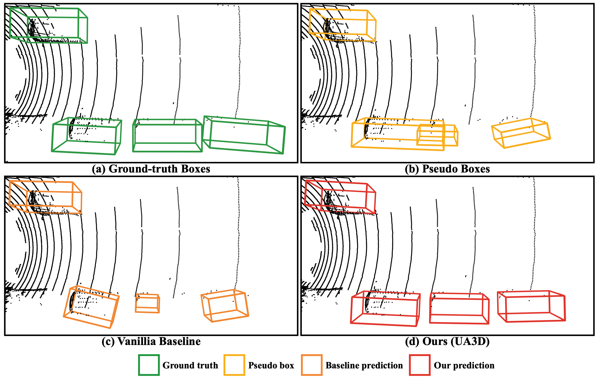

# Harnessing Uncertainty-aware Bounding Boxes for Unsupervised 3D Object Detection

by [Ruiyang Zhang](https://ruiyang-061x.github.io/), Hu Zhang, [Zhedong Zheng](https://www.zdzheng.xyz/)

## Motivation


## Abstract
Unsupervised 3D object detection aims to identify objects of interest from unla- beled raw data, such as LiDAR points. Recent approaches usually adopt pseudo 3D bounding boxes (3D bboxes) from clustering algorithm to initialize the model training. However, pseudo bboxes inevitably contain noise, and such inaccuracies accumulate to the final model, compromising the performance. Therefore, in an attempt to mitigate the negative impact of inaccurate pseudo bboxes, we intro- duce a new uncertainty-aware framework for unsupervised 3D object detection, dubbed UA3D. In particular, our method consists of two phases: uncertainty es- timation and uncertainty regularization. (1) In the uncertainty estimation phase, we incorporate an extra auxiliary detection branch alongside the original primary detector. The prediction disparity between the primary and auxiliary detectors could reflect fine-grained uncertainty at the box coordinate level. (2) Based on the assessed uncertainty, we adaptively adjust the weight of every 3D bbox co- ordinate via uncertainty regularization, refining the training process on pseudo bboxes. For pseudo bbox coordinate with high uncertainty, we assign a relatively low loss weight. Extensive experiments verify that the proposed method is robust against the noisy pseudo bboxes, yielding substantial improvements on nuScenes and Lyft compared to existing approaches, with increases of +6.9% AP<sub>BEV</sub> and +2.5% AP<sub>3D</sub> on nuScenes, and +4.1% AP<sub>BEV</sub> and +2.0% AP<sub>3D</sub> on Lyft.

## Environment
- Follow [`MODEST/README.md`](https://github.com/YurongYou/MODEST/blob/master/README.md) to install.

## Harnessing Uncertainty-aware Bounding Boxes for Unsupervised 3D Object Detection (UA3D)
### nuScenes
```bash
conda activate UA3D; bash scripts/seed_training_nuscenes.sh; bash scripts/self_training_nusc.sh -C "data_paths=nusc.yaml det_filtering.pp_score_threshold=0.7 det_filtering.pp_score_percentile=20 data_paths.bbox_info_save_dst=null calib_path=$(pwd)/downstream/OpenPCDet/data/nuscenes_boston/training/calib ptc_path=$(pwd)/downstream/OpenPCDet/data/nuscenes_boston/training/velodyne image_shape=[900,1600]"
```
### Lyft
```bash
conda activate UA3D; bash scripts/seed_training_lyft.sh; bash scripts/self_training_lyft.sh -C "det_filtering.pp_score_threshold=0.7 det_filtering.pp_score_percentile=20 data_paths.bbox_info_save_dst=null data_root=$(pwd)/downstream/OpenPCDet/data/lyft/training";
```

## Evaluation
### nuScenes
```bash
conda activate UA3D; cd downstream/OpenPCDet/tools; bash scripts/dist_test.sh 4 --cfg_file ../../downstream/OpenPCDet/tools/cfgs/nuscenes_boston_models/pointrcnn_dynamic_obj.yaml --ckpt PATH_TO_CKPT
```
### Lyft
```bash
conda activate UA3D; cd downstream/OpenPCDet/tools; bash scripts/dist_test.sh 4 --cfg_file ../../downstream/OpenPCDet/tools/cfgs/lyft_models/pointrcnn_dynamic_obj.yaml --ckpt PATH_TO_CKPT
```

## Checkpoints
### nuScenes experiments
| Model | ST rounds | Checkpoint  | Config file |
| ----- | :----:  | :----: | :----: |
| PointRCNN | 0 | [link](https://drive.google.com/file/d/1HrmG_QlJT_6ztN0NmqCMLpKRXhvduqj4/view?usp=sharing) | [cfg](downstream/OpenPCDet/tools/cfgs/nuscenes_boston_models/pointrcnn_dynamic_obj.yaml) |
| PointRCNN | 1 | [link](https://drive.google.com/file/d/13MkDu0p2_KEDKcOzHJxr3zieGaKO77TF/view?usp=sharing) | [cfg](downstream/OpenPCDet/tools/cfgs/nuscenes_boston_models/pointrcnn_dynamic_obj.yaml) |
| PointRCNN | 10 | [link](https://drive.google.com/file/d/12XM2oH7NxLkLS5omxjD4BMLlpI94heAl/view?usp=sharing) | [cfg](downstream/OpenPCDet/tools/cfgs/nuscenes_boston_models/pointrcnn_dynamic_obj.yaml) |

### Lyft experiments
| Model | ST rounds | Checkpoint  | Config file |
| ----- | :----:  | :----: | :----: |
| PointRCNN | 0 | [link](https://drive.google.com/file/d/1vGSNUxV3rAln2HLwohExNdAwHoZKnYz1/view?usp=sharing) | [cfg](downstream/OpenPCDet/tools/cfgs/lyft_models/pointrcnn_dynamic_obj.yaml) |
| PointRCNN | 1 | [link](https://drive.google.com/file/d/17_Xog-38a69rHIxQ3l2yf6vJKbbcFpH6/view?usp=sharing) | [cfg](downstream/OpenPCDet/tools/cfgs/lyft_models/pointrcnn_dynamic_obj.yaml) |
| PointRCNN | 10 | [link](https://drive.google.com/file/d/1Xgo5F6lJ7-e7_EAnhvb_J09BWpM87xV3/view?usp=sharing) | [cfg](downstream/OpenPCDet/tools/cfgs/lyft_models/pointrcnn_dynamic_obj.yaml) |

## Core Codes
- [`downstream/OpenPCDet/pcdet/models/backbones_3d/pointnet2_backbone.py`](downstream/OpenPCDet/pcdet/models/backbones_3d/pointnet2_backbone.py): Add auxiliary detector into original detection backbone.
- [`downstream/OpenPCDet/pcdet/models/dense_heads/point_head_template.py`](downstream/OpenPCDet/pcdet/models/dense_heads/point_head_template.py): Implement fine-grained uncertainty estimation and uncertainty regularization.
- [`downstream/OpenPCDet/pcdet/models/dense_heads/point_head_box.py`](downstream/OpenPCDet/pcdet/models/dense_heads/point_head_box.py): Necessary uncertainty-related params passage.
- [`downstream/OpenPCDet/pcdet/models/detectors/point_rcnn.py`](downstream/OpenPCDet/pcdet/models/detectors/point_rcnn.py): Combine primary detector loss and auxiliary detector loss into final supervision loss.
- [`downstream/OpenPCDet/tools/cfgs/nuscenes_boston_models/pointrcnn_dynamic_obj.yaml`](downstream/OpenPCDet/tools/cfgs/nuscenes_boston_models/pointrcnn_dynamic_obj.yaml): nuScenes hyperparameters for auxilary detector, including FPLayers, PointHead, and ROIHead.
- [`downstream/OpenPCDet/tools/cfgs/lyft_models/pointrcnn_dynamic_obj.yaml`](downstream/OpenPCDet/tools/cfgs/lyft_models/pointrcnn_dynamic_obj.yaml): Lyft hyperparameters for auxilary detector, including FPLayers, PointHead, and ROIHead.
- [`downstream/OpenPCDet/pcdet/models/detectors/detector3d_template.py`](downstream/OpenPCDet/pcdet/models/detectors/detector3d_template.py): Update 3D detection template topology to support auxiliary detector structure.

## License
This project is under the MIT License.

## Contact
Please open an issue if you have any questions about using this repo.

## Acknowledgement
Our repo is based on [MODEST(CVPR'22)](https://github.com/YurongYou/MODEST), [OpenPCDet](https://github.com/open-mmlab/OpenPCDet). Thanks for their great works and open-source effort!

## Citation
```bib
@inproceedings{zhang2024harnessing,
  title={Harnessing Uncertainty-aware Bounding Boxes for Unsupervised 3D Object Detection},
  author={Zhang, Ruiyang and Zhang, Hu and Yu, Hang and Zheng, Zhedong},
  booktitle={ICCV},
  year={2025}
}
```
